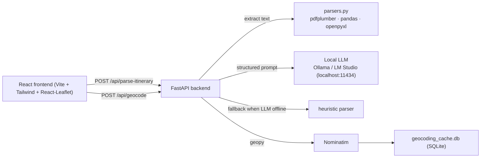

# Travel Journey Map

A lightweight, low-resource web application for uploading travel itineraries,
extracting visited locations, geocoding them, and plotting them on an interactive
2D map — all running locally.

## Architecture



## Features

- **Upload & input** — drag-and-drop PDF, Excel, CSV, or paste raw text.
- **Local LLM extraction** — messy itineraries are structured via Ollama / LM Studio
  (falls back to a lightweight heuristic parser when the LLM is unreachable).
- **Structured passthrough** — files with Location / Date / Notes / Lat / Lng columns
  bypass the LLM entirely.
- **Context-aware disambiguation** — the LLM receives contextual instructions to infer
  countries/regions; ambiguous places (e.g. "Hamilton, NZ" vs "Hamilton, USA") are
  flagged for manual resolution.
- **Date-based classification** — every stop is classified as *Past*, *Current*, or
  *Upcoming* based on its dates. A timeline filter lets you view trips by category
  or by year.
- **Travel-velocity feasibility check** — if the implied speed between sequential
  stops exceeds realistic limits (900 km/h), the stop is flagged as ambiguous and
  a disambiguation dropdown is shown in the table.
- **Geocoding with cache** — location strings are resolved via Nominatim (OpenStreetMap);
  results are cached in SQLite so repeated runs incur no network cost.
- **Interactive map** — numbered markers (amber when ambiguous), popups with dates,
  category, and warnings, connecting polyline rendered in chronological order.
- **Editable table** — add, reorder, edit, or delete stops; re-geocode with
  feasibility check.
- **Export** — download the trip as a JSON file, or a standalone interactive HTML map
  (Leaflet CDN, no server needed) with dates, categories, and ambiguity warnings.

## Requirements

- **Python** 3.10–3.14 (the backend uses type-union syntax from 3.10+)
- **Node.js** ≥ 18
- **npm** ≥ 9
- **Local LLM** (optional) — [Ollama](https://ollama.com) or LM Studio running on
  `localhost:11434`. A model like `llama3.2` (3B) or `qwen2.5:3b` works well.
  Without an LLM the app still works using the heuristic fallback parser.

## Quick start

```bash
make install   # create venv, pip install, npm install
make dev       # launch backend + frontend concurrently
```

Open **http://localhost:5173** in your browser.

### Manual start

```bash
# Backend
cd backend
python3 -m venv .venv
.venv/bin/pip install -r requirements.txt
.venv/bin/uvicorn main:app --reload --host 127.0.0.1 --port 8000

# Frontend (separate terminal)
cd frontend
npm install
npm run dev
```

## Environment variables

| Variable          | Default                    | Description                                       |
| ----------------- | -------------------------- | ------------------------------------------------- |
| `LLM_BASE_URL`    | `http://localhost:11434`   | Ollama / LM Studio base URL                       |
| `LLM_MODEL`       | `llama3.2`                 | Model name to use for parsing                     |
| `LLM_TIMEOUT`     | `120`                      | Seconds to wait for an LLM response               |
| `GEOCODE_DELAY`   | `1.0`                      | Min seconds between Nominatim requests (policy)   |

## API

### `GET /api/health`

```json
{
  "status": "ok",
  "service": "travel-journey-map",
  "llm": {
    "url": "http://localhost:11434",
    "model": "llama3.2",
    "reachable": true,
    "available_models": ["qwen2.5-coder:14b", "deepseek-coder-v2:16b", "gemma4:e4b"]
  }
}
```

`available_models` is a live listing from the local Ollama/LM Studio instance; it is
`[]` when the LLM is unreachable.

### `POST /api/parse-itinerary`

Accepts multipart form data with either a **file** field or a **text** field.

**File upload**:
```
curl -F "file=@trip.pdf" http://localhost:8000/api/parse-itinerary
```

**Raw text**:
```
curl -F "text=Day 1: Landed in London" http://localhost:8000/api/parse-itinerary
```

Returns:
```json
{
  "source_type": "pdf",
  "text_preview": "…first 2000 characters…",
  "llm_used": true,
  "stops": [
    { "order": 1, "location": "Lisbon", "exact_location": "Lisbon, Portugal", "start_date": "2024-06-03", "end_date": "2024-06-03", "category": "Past", "notes": "Arrived, walked Alfama, fado show", "lat": null, "lng": null },
    { "order": 2, "location": "Sintra", "exact_location": "Sintra, Portugal", "start_date": "2024-06-04", "end_date": "2024-06-04", "category": "Past", "notes": "Pena Palace, Quinta da Regaleira", "lat": null, "lng": null }
  ]
}
```

Each stop now includes:
- `exact_location` — full context-aware place name (city, region, country)
- `start_date` / `end_date` — ISO dates (YYYY-MM-DD)
- `category` — `"Past"`, `"Current"`, or `"Upcoming"` (computed deterministically)

### `POST /api/geocode`

**Legacy format** (array of strings):
```json
// Request
{ "locations": ["Lisbon, Portugal", "Sintra, Portugal"] }

// Response
{
  "results": [
    { "location": "Lisbon, Portugal", "lat": 38.7223, "lng": -9.1393, "found": true, "cached": false, "error": null },
    { "location": "Sintra, Portugal", "lat": 38.7999, "lng": -9.3883, "found": true, "cached": true, "error": null }
  ],
  "feasibility": []
}
```

**Stops format** (with feasibility check):
```json
// Request
{
  "stops": [
    { "order": 1, "location": "Auckland", "exact_location": "Auckland, New Zealand", "start_date": "2024-01-01", "end_date": "2024-01-01", "lat": -36.85, "lng": 174.76 },
    { "order": 2, "location": "Hamilton", "exact_location": "Hamilton, Ohio, USA", "start_date": "2024-01-01", "end_date": "2024-01-01", "lat": 39.4, "lng": -84.56 }
  ]
}

// Response
{
  "results": [
    { "order": 1, "lat": -36.85, "lng": 174.76, "found": true, "cached": true, "error": null },
    { "order": 2, "lat": 39.4, "lng": -84.56, "found": true, "cached": true, "error": null }
  ],
  "feasibility": [
    { "order": 1, "location": "Auckland", "exact_location": "Auckland, New Zealand", "is_ambiguous": false, "warning": null, "candidates": [] },
    { "order": 2, "location": "Hamilton", "exact_location": "Hamilton, Ohio, USA", "is_ambiguous": true, "warning": "Implied travel speed ...", "candidates": ["Hamilton, Waikato, New Zealand", "Hamilton, Ohio, USA"] }
  ]
}
```

When `stops` is provided, the backend:
1. Skips stops that already have coordinates.
2. Geocodes the remaining stops (deduplicating queries).
3. Runs a travel-velocity feasibility check: if the implied speed between sequential stops exceeds 900 km/h, the stop is flagged `is_ambiguous: true`.
4. For flagged stops, Nominatim is queried for candidate disambiguation names.

## Setting up a local LLM

```bash
# Install Ollama (macOS / Linux)
curl -fsSL https://ollama.com/install.sh | sh

# Pull a small, fast model
ollama pull llama3.2

# The app connects to http://localhost:11434 by default.
```

> **Model not found?** If the app logs `model not found` (HTTP 404 from Ollama), the
> configured `LLM_MODEL` isn't installed on your machine. Run `ollama list` to see
> what you have, then start the backend with an installed model, e.g.:
>
> ```bash
> LLM_MODEL=qwen2.5-coder:14b make dev
> ```

## Hardware notes

- **CPU / RAM**: the Python backend idles at ~30 MB RSS. The React frontend is
  ~5 MB in the browser after a cold load. Latency-sensitive work (parsing / geocoding)
  runs in background threads, so the UI stays responsive.
- **GPU**: Leaflet renders via canvas / SVG — no GPU acceleration needed.
- **Disk**: Geocoding cache grows slowly (~1 KB per unique location).
- **LLM**: Running a 3B model locally uses ~2–4 GB RAM and moderate CPU. The app
  works fine without it (heuristic fallback).

## Notes

- **Nominatim usage policy**: The default `GEOCODE_DELAY=1.0` respects the 1 req/s
  limit. Reduce it only for local testing.
- **OSM tiles**: The map fetches tiles from OpenStreetMap's public CDN, so internet
  is required for the map background. The rest of the app runs fully offline.
- **Python 3.14**: If `pip install pandas` fails on Python 3.14 (pre-release),
  remove `pandas` from `requirements.txt` — CSV/Excel parsing falls back to
  `csv` / `openpyxl` automatically.
- **Export HTML**: The downloaded `.html` file is self-contained and loads Leaflet
  from CDN — it needs internet to display the map.
- **CSV columns**: CSV/Excel columns are matched by header name (Location, Date,
  Notes, Lat, Lng). If a location contains a comma (e.g. `Paris, France`) the field
  must be quoted in the CSV, otherwise the comma shifts the columns. Most
  spreadsheet apps quote automatically when exporting.

## Project structure

```
MyTravelMap/
├── backend/
│   ├── main.py                                # FastAPI application
│   ├── parsers.py                             # PDF/Excel/CSV text extraction + feasibility
│   ├── geocoder.py                            # Nominatim geocoder + SQLite cache
│   ├── smoke_test.py                          # endpoint smoke test (offline-friendly)
│   └── requirements.txt
├── frontend/
│   ├── public/
│   │   └── sample_itinerary.txt               # sample for the "Load sample" button
│   ├── src/
│   │   ├── main.jsx                           # React entry point
│   │   ├── index.css                          # Tailwind + global styles
│   │   ├── api.js                             # fetch helpers
│   │   ├── App.jsx                            # state management + layout
│   │   └── components/
│   │       ├── UploadPanel.jsx                # file dropzone + text input
│   │       ├── ItineraryTable.jsx             # editable itinerary table with disambiguation
│   │       ├── MapView.jsx                    # Leaflet map with markers + polyline
│   │       └── ControlPanel.jsx               # timeline filter, recenter, export
│   ├── index.html
│   ├── package.json
│   └── vite.config.js                         # Vite proxy /api → :8000
├── examples/
│   ├── sample_itinerary.txt                   # messy multi-day trip
│   └── sample_itinerary.csv                   # structured CSV with Location/Date/Notes
├── Makefile
├── .gitignore
└── README.md
```